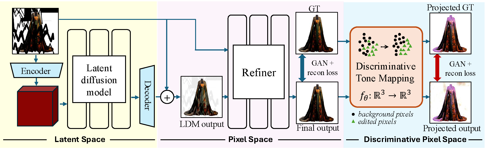
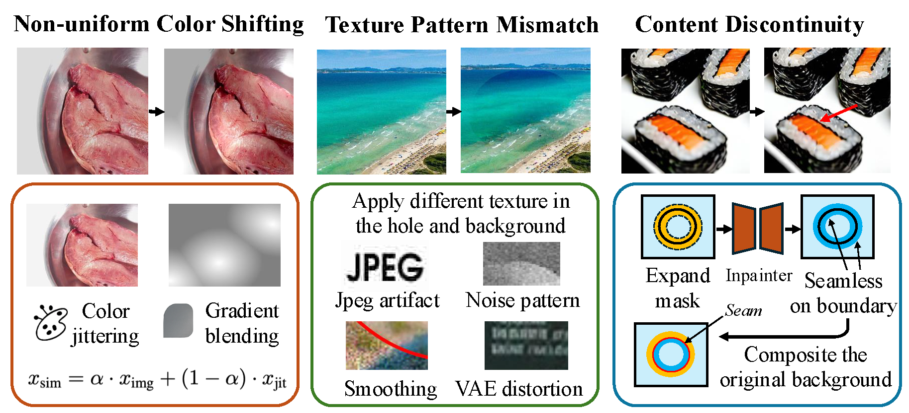

# PixPerfect: Seamless Latent Diffusion Local Editing with Discriminative Pixel-Space Refinement (NeurIPS 2025)

**Haitian Zheng\*<sup>1</sup>, Yuan Yao\*<sup>2</sup>, Yongsheng Yu<sup>2</sup>, Yuqian Zhou<sup>1</sup>, Jiebo Luo<sup>2</sup>, Zhe Lin<sup>1</sup>**  
<sup>1</sup>Adobe Research   <sup>2</sup>University of Rochester  
\* Equal contribution

> Official page for **PixPerfect: Seamless Latent Diffusion Local Editing with Discriminative Pixel-Space Refinement (NeurIPS 2025)**.

<div align="center">
  


*Figure 1: PixPerfect refines LDM-based local edits in pixel space, removing color shifts, texture mismatches, and boundary seams.*

</div>

---

## 📝 Overview

Latent Diffusion Models (LDMs) have brought high-quality and flexible **local image editing** and **inpainting** to real-world creative workflows. However, the latent compression step often introduces **pixel-level inconsistencies**—including chromatic shifts, texture-pattern mismatches, and visible seams at editing boundaries—that are hard to fully remove in pixel space.

Existing remedies, such as background-conditioned latent decoding or simple image harmonization, can reduce these artifacts but:

- rarely remove them completely, and  
- do not generalize well across **different architectures**, **latent representations**, or **editing tasks**.

**PixPerfect** is a **model- and task-agnostic, plug-and-play refinement module** that operates in **pixel space** to clean up these artifacts and deliver **production-level, seamless local edits** on top of diverse LDM-based pipelines.

---

## ✨ Key Contributions

- **Plug-and-play refinement for LDM-based editing**  
  PixPerfect is a lightweight, modular refiner that can be attached to a wide range of **inpainting** and **local-editing** diffusion models without modifying their internal architectures.

- **Editing artifact simulation pipeline**  
  We introduce a **comprehensive artifact simulation pipeline** for local editing and inpainting that mimics realistic failures:
  non-uniform color shifts, texture-pattern mismatches, content discontinuities, and both feathered and abrupt edit boundaries.

- **Discriminative pixel-space transformation**  
  We design a learnable **color-space transformation** that maps RGB pixels into a discriminative space where **subtle chromatic and textural differences** between the edited region and the background are **amplified**, making artifacts easier to detect and correct.

- **Multi-space training objective**  
  The refiner is trained with **L1**, **LPIPS**, and **GAN** objectives, applied in both:
  - the original **RGB space**, and  
  - the **discriminative pixel space**,  
  leading to robust refinement across architectures and tasks.

---

## 🧠 Method at a Glance

<div align="center">
  


*Figure 2: PixPerfect pipeline. A latent diffusion model produces a local edit in pixel space. Our refiner uses a discriminative pixel-space objective and an artifact simulation pipeline to correct subtle color/texture mismatches and boundary seams.*

</div>

<div align="center">
  


*Figure 3: Editing artifact simulation pipeline. We synthesize realistic local-editing and inpainting artifacts by applying non-uniform color shifts, texture/content perturbations, and feathered or sharp boundaries to clean images.*

</div>

**High-level workflow:**

1. **Base LDM edit**  
   An LDM-based inpainting or local-editing model generates an edited image in pixel space, often containing small but noticeable artifacts at edit boundaries.

2. **Editing artifact simulation**  
   During training, we synthesize realistic local-editing artifacts by combining:
   - non-uniform color shifts,  
   - texture-pattern mismatches,  
   - content discontinuities, and  
   - feathered / abrupt boundaries.

3. **Discriminative pixel space**  
   A learnable color-space transform \( y = f(x) \) maps RGB pixels \( x \) into a discriminative space where subtle differences between edited and background regions are magnified.

4. **Pixel-space refinement**  
   A refiner network is trained with L1, LPIPS, and GAN losses in both RGB and discriminative pixel space to remove artifacts and restore **pixel-consistent, seamless** local edits.

---

<!-- ## 📊 Results

### Qualitative Comparisons

<div align="center">
  


*Figure 3: Object insertion. Top: editing inputs. Middle: outputs from an LDM-based editing model (e.g., AnyDoor / FLUX-Fill). Bottom: PixPerfect refinement removes seams and harmonizes color and texture with the background.*

</div>

<div align="center">
  


*Figure 4: Inpainting. LDM-only outputs exhibit residual color shifts and boundary artifacts, especially in textured regions. PixPerfect produces more coherent, boundary-free inpainting results.*

</div>

### Quantitative Improvements

Across multiple benchmarks and tasks (e.g., **inpainting**, **object removal**, **object insertion**), PixPerfect consistently improves:

- **Perceptual metrics** (e.g., LPIPS, FID)  
- **Pixel-level metrics** (e.g., PSNR, SSIM)  
- **Downstream editing performance**, where artifact-free local edits are crucial for subsequent processing or user evaluation.

<div align="center">
  


*Figure 5: PixPerfect substantially improves perceptual fidelity and quantitative performance over LDM-only baselines and post-hoc harmonization methods, across a variety of tasks and backbones.*

</div>

--- -->

## 💡 Why PixPerfect?

- **Model-agnostic**  
  Works with different LDM architectures and latent designs without retraining the base model.

- **Task-agnostic**  
  Applicable to diverse local editing scenarios, from **inpainting** and **object removal** to **object insertion** and **attribute editing**.

- **Production-ready**  
  Designed to meet the expectations of real creative workflows, where even small seams and color drifts are noticeable and unacceptable.

- **Lightweight and easy to integrate**  
  Acts as a final pixel-space refinement stage, making it suitable for integration into existing pipelines and products.

---

<!-- ## 📄 Paper

If you use PixPerfect in your research or products, please consider citing:

```bibtex
@inproceedings{zheng2025pixperfect,
  title     = {PixPerfect: Seamless Latent Diffusion Local Editing with Discriminative Pixel-Space Refinement},
  author    = {Zheng, Haitian and Yao, Yuan and Yu, Yongsheng and Zhou, Yuqian and Luo, Jiebo and Lin, Zhe},
  booktitle = {Advances in Neural Information Processing Systems (NeurIPS)},
  year      = {2025}
} -->